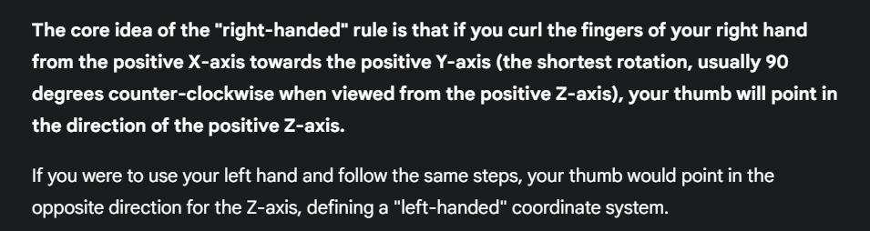
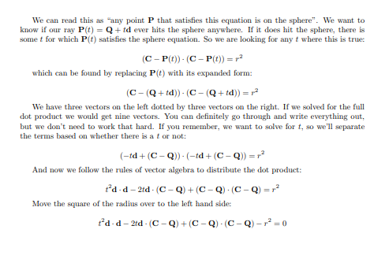

Simple graphics renderer from scratch in Rust.

# What I've learned.
- Whenever you start a renderer, you need a way to see an image. The most straightforward way is to write it to a file.
- There are many file formats but for the purpose of this book, we will start with a plain text ppm file
- For the rendering of the img format itself:
	1. The pixels are written out in rows.

	2. Every row of pixels is written out left to right.

	3. These rows are written out from top to bottom.

	4. By convention, each of the red/green/blue components are represented internally by real-valued variables that range from 0.0 to 1.0. These must be scaled to integer values between 0 and 255 before we print them out.

	5. Red goes from fully off (black) to fully on (bright red) from left to right, and green goes from fully off at the top (black) to fully on at the bottom (bright green). Adding red and green light together make yellow so we should expect the bottom right corner to be yellow.
- Almost all graphics programs have some class(es) for storing geometric vectors and colors. In many systems these vectors are 4D (3D position plus a homogeneous coordinate for geometry, or RGB plus an alpha transparency component for colors). For our purposes, three coordinates suffice. ..(hence the Vec3 class)
- Converting a floating point value in the range [0, 1] into an int value in the range [0, 255], multiply by 255.999 and cast to int.
	- Why not just 256?
			Because, 255 is the max representation in an 8 bit integer which you want, 256 would overflow
	- Ok then why not just use 255?
			Because, only 1.0 would equate to 255 but with 255.999, values close to 1.0 can also evaluate to 255
-  The one thing that all ray tracers have is a ray class and a computation of what color is seen along a ray. Let’s think of a ray as a function:  
`P(t) = A + tb`  
Here `P` is a 3D position along a line in 3D. `A` is the ray origin and `b` is the ray direction. The ray parameter `t` is a real number (f64 in the code). Plug in a different `t` and `P(t)` moves the point along the ray. Add in negative `t` values and you can go anywhere on the 3D line. For positive `t`, you get only the parts in front of `A``, and this is what is often called a half-line or a ray.
- At its core, a ray tracer sends rays through pixels and computes the color seen in the direction of those rays. The involved steps are:
	1. Calculate the ray from the “eye” through the pixel,
	2. Determine which objects the ray intersects, and
	3. Compute a color for the closest intersection point.
- When first developing a ray tracer, we should do a simple camera for getting the code up and running.
- We'll be rendering images in the 16:9 aspect ratio
- Since we have a given aspect ratio in mind, it's easier to set the image's width and the aspect ratio, and then using this to calculate for its height. This way, we can scale up or down the image by changing the image width, and it won't throw off our desired aspect ratio. We do have to make sure that when we solve for the image height the resulting height is at least 1.
- In addition to setting up the pixel dimensions for the rendered image, we also need to set up a virtual viewport through which to pass our scene rays.
- The viewport is a virtual rectangle in the 3D world that contains the grid of image pixel locations. If pixels are spaced the same distance horizontally as they are vertically, the viewport that bounds them will have the same aspect ratio as the rendered image.
- The distance between two adjacent pixels is called the `pixel spacing`, and square pixels is the standard.
- If you're wondering why we don't just use `aspect_ratio` when computing `viewport_width`, it's because the value set to `aspect_ratio` is the ideal ratio, it may not be the actual ratio between image_width and `image_height`. If `image_height` was allowed to be real valued—rather than just an integer—then it would be fine to use `aspect_ratio`.
- For simplicity we'll start with the camera center at \((0,0,0)\). We'll also have the y-axis go up, the x-axis to the right, and the negative z-axis pointing in the viewing direction. (This is commonly referred to as right-handed coordinates.)
	
- I'll use a standard graphics trick to linearly scale `0.0 ≤ a ≤ 1.0`. When `a = 1.0`, I want blue. When `a = 0.0`, I want white. In between, I want a blend. This forms a “linear blend”, or “linear interpolation”. This is commonly referred to as a **lerp** between two values. A lerp is always of the form:  
	`blendedValue = (1-a) • startValue + a • endValue`  
  where `a` goes from zero to one.
- The equation for a sphere of radius \(r\) that is centered at the origin is an important mathematical equation:  
	`x^2 + y^2 + z^2 = r^2`  
  You can also think of this as saying that if a given point `(x,y,z)` is on the surface of the sphere, then `x^2 + y^2 + z^2 = r^2`. If a given point `(x,y,z)` is inside the sphere, then `x^2 + y^2 + z^2 < r^2`, and if a given point `(x,y,z)` is outside the sphere, then `x^2 + y^2 + z^2 > r^2`.  
	If we want to allow the sphere center to be at an arbitrary point	`(C_x, C_y, C_z)`, then the equation becomes a lot less nice:  
	`(C_x - x)^2 + (C_y - y)^2 + (C_z - z)^2 = r^2`
- Since we have conveniently created our `Vec3` class, we can easily realize that given a vector `C` with coordinates`(C_x, C_y, C_z)`, and another, `p` with coords `(x, y, z)`, their `C - p` = `(C_x - x, C_y - y, C_z - z)`, and by using dot product of two vectors:  
`(C-p) • (C-p)` = `(C_x - x)^2 + (C_y - y)^2 + (C_z - z)^2`  
which means that:  
`(C-p) • (C-p) = r^2`  
We can read this as "any point `p` which satisfies the equation above is on the sphere"
	- Because `p` is a function of `t`, `p` = `P(t)`, giving us  
	`(C-P(t)) • (C-P(t)) = r^2`  
	- Replacing `P(t)` with it's full form gives us  
	`(C-(Q + t*d)) • (C - (Q + (t*d))) = r^2`  
	- Expanding terms 1 and 2  
	`(C - Q - t*d) • (C - Q - t*d) = r^2`  
	=> `(-td + (C-Q)) • (-td + (C-Q)) = r^2;  
	- Following the rules of vector algebra, we distribute the product:  
	`t^2d⋅d − 2td⋅(C−Q) + (C−Q)⋅(C−Q) = r2`
	See image below for full explanation:  
	
	- The only vectors that we have are reduced to scalars by dot product. The only unknown is t, and we have a t^2
	, which means that this equation is quadratic. You can solve for a quadratic equation ax2+bx+c=0
	by using the quadratic formula:  
	`(−b ± sqrt(b^2−4ac))/2a`

## Shading
- First, let’s get ourselves a surface normal so we can shade. This is a vector that is perpendicular to the surface at the point of intersection.
- All normal vectors will be of unit length
- For a sphere, the outward normal is in the direction of the hit point minus the center e.g the vector from the earth's center to you point's straight up
- Without lights, we can visualize the normals with a color map.
- A common trick for visualizing normals (because it’s easy and somewhat intuitive to assume n is a unit length vector — so each component is between −1 and 1) is to map each component to the interval from 0 to 1, and then map (x,y,z) to (red,green,blue)
- We are currently calculating just whether the ray hit the sphere or not, for the normal, we'd need to know the hit point.
- Because we only have one sphere directly in front of the camera, no need to worry about negative values of `t` yet.
- The closest hit point i.e smallest `t` is the point we want.
- The second design decision for normals is whether they should always point out.
- Currently, if the ray intersects the sphere from the outside, the normal points **against** the ray. If the ray intersects the sphere from the inside, the normal (which always points out) points **with** the ray. 
- Alternatively, we can have the normal always point against the ray. If the ray is outside the sphere, the normal will point **outward**, but if the ray is inside the sphere, the normal will point **inward**.
- If we decide to have the normals always point out from the center of the object, then we will need to determine which side the ray is on when we color it. We can figure this out by comparing the ray with the normal. If the ray and the normal face in the same direction, the ray is inside the object, if the ray and the normal face in the opposite direction, then the ray is outside the object. This can be determined by taking the dot product of the two vectors, where if their dot is positive, the ray is inside the sphere.
- We can set things up so that normals always point “outward” from the surface, or always point against the incident ray. This decision is determined by whether you want to determine the side of the surface at the time of geometry intersection or at the time of coloring. In this book we have more material types than we have geometry types, so we'll go for less work and put the determination at geometry time. This is simply a matter of preference.
----
- To shade a cube, the normal of the cube is simply perpendicular to the face hit, so we can check for the axis of the hitpoint and get the normal from that face to use in our HitRecord
## Interval
- Now we'll implement real-valued intervals with a minimum and maximum
- This helps to keep track of ray min and max precisely, essentially cleaner code
## Camera
- Now, we consolidate our camera and scene-render code into a single new class: the `camera` class
- Camera does the following:
	1. Construct and dispatch rays into the world.
	2. Use the results of these rays to construct the rendered image.
## Antialiasing
- The stair-stepping in the generated images is commonly referred to as “aliasing”, or “jaggies”.
- When a real camera takes a picture, there are usually no jaggies along edges, because the edge pixels are a blend of some foreground and some background because unlike our rendered image, a true image has infinite resolution.
- We can get the same effect by averaging a bunch of pixels
- With a single ray through the center of each pixel, we are performing what is commonly called **point sampling**.
- The problem with **point sampling** can be illustrated by rendering a small checkerboard far away. If this checkerboard consists of an 8×8 grid of black and white tiles, but only four rays hit it, then all four rays might intersect only white tiles, or only black, or some odd combination. In the real world, when we perceive a checkerboard far away with our eyes, we perceive it as a gray color, instead of sharp points of black and white.
- Because our eyes are naturally doing what we want our ray tracer to do: integrate the (continuous function of) light falling on a particular (discrete) region of our rendered image.
- We want to sample the light falling around the pixel, and then integrate those samples to approximate the true continuous result. So, how do we integrate the light falling around the pixel?
- We'll adopt the simplest model: sampling the square region centered at the pixel that extends halfway to each of the four neighboring pixels.
- For a single pixel composed of multiple samples, we'll select samples from the area surrounding the pixel and average the resulting light (color) values together.
- To do this, we'll add the full color from each iteration *(read sample)*, and then finish with a single division (by the number of samples) at the end, before writing out the color.
- To ensure that the color components *(r, g, b)* of the final result remain within the proper [0,1] bounds, we'll clamp it to [0, 1]

## Diffuse materials
- Now that we have objects and multiple rays per pixel, we can make some realistic looking materials.
- Starting with diffuse materials a.k.a **matte**
- We have to choose between mixing and matching geometry and materials, or tightly binding them together
	- The former allows us to assign a material to multiple spheres or vice-versa
	- The latter can be useful for procedural objects where geometry and material are linked
- For the purpose of this project, we will go with the former, i.e, separate.

### A simple diffuse material
- Diffuse material do NOT emit light but take on light of their surroundings and modulate that with their own intrinsic color
- Light that reflects off a diffuse surface has it's direction randomized
- This light may also be absorbed instead of deflected.
- The likelihood of absorption increases with darkness of the surface
- Really any algorithm that randomizes direction will produce surfaces that look matte.
- Starting with the most intuitive algorithm: A material that randomly bounces a ray in any direction with equal probability
- For this material, a ray that hits the surface has an equal probability of bouncing in any direction away from the surface.
- This is the simplest kind of diffuse
- First we need the ability to generate arbitrary random vectors
- Then we need to figure out how to manipulate a random vector so that we only get results that are on the surface of a hemisphere.
- Alot of the analytical methods to do this are complicated, hence we'll be using a rejection method:
	- Reject every random generation until we get one satisfying our criteria
- We'll also be going for the simplest rejection method algorithm which is:
	1. Generate a random vector inside the unit sphere (sphere of radius 1).
	2. Normalize this vector to extend it to the sphere surface.
	3. Invert the normalized vector if it falls onto the wrong hemisphere
- We'll perform step 1 by picking a random point inside a cube enclosing the unit sphere i.e x,y,z all in the range (-1, 1)
- If this point lies outside the unit sphere, reject, else choose
- Normalize this vector (from point to sphere center) to make unit vector
- Since floating-point numbers have finite precision, a very small value can underflow to zero when squared.
- So if all three coordinates are small enough (that is, our point very near the center of the sphere), the norm of the vector will be zero, and thus normalizing will yield the bogus vector [±∞,±∞,±∞]
- We create a "black hole" range and reject any point within this black hole
- Now that we have a random unit vector, we can determine if it is on the correct hemisphere by comparing against the surface normal (i.e, the angle between them must be at most 90 degrees)
- If a ray bounces off of a material and keeps 100% of its color, then we say that the material is white.
- If it instead keeps 0% of its color, then we say that the material is black.
- Let's first set our `ray_color` to return 50% of the color from a bounce, we should get a nice gray
### Fixing shadow Acne
- A ray will attempt to accurately calculate the intersection point when it intersects with a surface. Unfortunately, this calculation is susceptible to floating point rounding errors which can cause the intersection point to be ever so slightly off.
- This means that the origin of the next ray, the ray that is randomly scattered off of the surface, is unlikely to be perfectly flush with the surface. It might be just above the surface. It might be just below the surface.
- If the ray's origin is just below the surface then it could intersect with that surface again. Which means that it will immediately find the nearest surface at t=0.00000001 or whatever floating point approximation the hit function gives us.
- The simplest hack to address this is just to ignore hits that are very close to the calculated intersection point e.g instead of starting `t` from 0.00, we start from 0.01
### True Lambertian Reflection
- A more accurate representation of real diffuse objects is the Lambertian distribution.
- This distribution scatters reflected rays in a manner that is proportional to cos(ϕ), where ϕ is the angle between the reflected ray and the surface normal.
- This means that a reflected ray is most likely to scatter in a direction near the surface normal, and less likely to scatter in directions away from the normal.
- At the point of intersection of ray and sphere, there is a hit point, `p`, and surface normal `n`.
- There can only be two unique unit spheres tangent to any intersection point (one unique sphere for each side of the surface).
- We are concerned with the unit sphere on the outside which has a center `p+n`
- Pick a random point `S` on this outside unit sphere, this is the vector `S-p`
- Notice more pronounced shadow and spheres takes sky tint if you change sky color
### Using Gamma correction for accurate color intensity
- Notice how even though we reflect 50% of all light, the sphere looks darker than it should, our shadow should look much darker than sphere
- You can observe by changing reflectance to 0.1, 0.3, 0.5, 0.7, 0.9
- Notice how 70 is closer to the halfway point.
- The reason for this is that almost all computer programs assume that an image is “gamma corrected” before being written into an image file.
- "Gamma corrected" means that the 0 to 1 values have some transform applied before being stored as a byte.
- Images with data that are written without being transformed are said to be in linear space, whereas images that are transformed are said to be in gamma space. It is likely that the image viewer you are using is expecting an image in gamma space, but we are giving it an image in linear space. This is the reason why our image appears inaccurately dark.
- There are many good reasons for why images should be stored in gamma space, but for our purposes we just need to be aware of it.
- As a simple approximation, we can use “gamma 2” as our transform, which is the power that you use when going from gamma space to linear space.
- We need to go from linear space to gamma space, which means taking the inverse of “gamma 2", which means an exponent of 1/gamma
, which is just the square-root. We'll also want to ensure that we robustly handle negative inputs.

## Abstract class for Materials ( Trait for Materials )
- If we want different objects to have different materials, we have a design decision to make
	- We could have a universal material type with lots of parameters so any individual material type could just ignore the parameters that don't affect it.
	- Or we could have an abstract material class that encapsulates unique behavior.
	- We will go with the latter.
- Each Material should:
	1. Produce a scattered ray (or say it absorbed the incident ray).
	2. If scattered, say how much the ray should be attenuated.
- When the ray_color() routine gets the `hit_record` it can call member functions of the material pointer to find out what ray, if any, is scattered.
- To achieve this, `hit_record` needs to be told the material that is assigned to the sphere
### Modelling light scatter and reflectance
- Our HitRecord holds a bunch of data, can also hold material hit (basically an encapsulation of arguments)
- When the `ray_color()` routine gets the `hit_record` it can call member functions of the material pointer to find out what ray, if any, is scattered.
- Here and throughout these books we will use the term albedo (Latin for “whiteness”).
- Albedo is a term used to define some form of fractional reflectance
- Albedo will vary with material color and (as we will later implement for glass materials) can also vary with incident viewing direction (the direction of the incoming ray).
- Lambertian (diffuse) reflectance can either always scatter and attenuate light according to its reflectance `R`, or it can sometimes scatter (with probability 1−R) with no attenuation (where a ray that isn't scattered is just absorbed into the material).
- It could also be a mixture of both those strategies.
- Attenuation of light refers to the gradual decrease in the intensity of light as it propagates through a medium.
- We will choose to always scatter, so implementing Lambertian materials becomes a simple task.
- In our implementation of Lambertian reflection, we could scatter with some fixed probability p and have attenuation be albedo/p
- In out implementation, if we have our random_vector, and normal_vector add up to 0, we may get some undesired behavior (infinities, NaNa), so we account for that by checking if the resultant vector is near zero and replacing it with hit_record normal if true.

